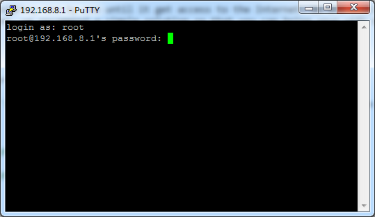
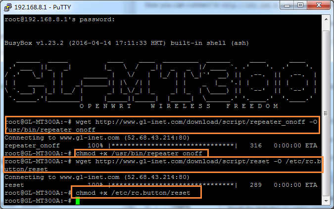

## One-Radio device problem in Repeater mode

The mini routers is One-Radio device, which caused a problem in repeater mode. When your repeater cannot connect, its own ap will not boot.

For example, you go to one hotel and connect the mini router to the hotel's wifi as WISP repeater. But when you go to another hotel when the original ssid is not available, you cannot connect to the router via WiFi. You need a cable to connect.

There are some solutions to solve this problem. One is like this post: http://www.gl-inet.com/forums/topic/wifimgr-tool-to-automaticaly-select-an-apstation-from-a-list-of-saved-aps/ 

The script try to connect a list of saved ssid/key one by one until it get access to the Internet. We are still make our script based on this. At this moment, we recommend a simple solution so that you can bring your wifi back by pressing the reset button.

## Reset Repeater WISP

The idea is simple, to turn off the repeater connection by pressing the `Reset` button. 

First you need connect to the router using `ssh` when you still have Ineternet connection. Then try to execute the the following command one by one.

```
$ wget http://www.gl-inet.com/download/script/repeater_onoff -O /usr/bin/repeater_onoff
$ chmod +x /usr/bin/repeater_onoff
$ wget http://www.gl-inet.com/download/script/reset -O /etc/rc.button/reset 
$ chmod +x /etc/rc.button/reset

```

Then it is done.

When you cannot connect to the repeater and don't have wifi, just press the reset button. The repeater will be turned off and your ap is back. Now you can connect to `http://192.168.8.1` and reset up the repeater.

Warning: this only works for WISP. It doesn't work for WDS and Relayd bridge. 

Note: Don't forget to press the Reset button again after you choose to connect to another ssid. 

## How to use SSH

If you are using Linux or Mac, you will have `ssh` by default. Just execute:

```
$ ssh root@192.168.8.1
```

If you are using windows, we recommend `putty`. Download from here: https://the.earth.li/~sgtatham/putty/latest/x86/putty.exe 

Excute putty, then input IP `192.168.8.1`, Port `22` and choose connection type `ssh`, then click `Open`.

You will be shown a black window. Type username `root` and then your password. You are in.



Then you need to execute the above command one by one. 




